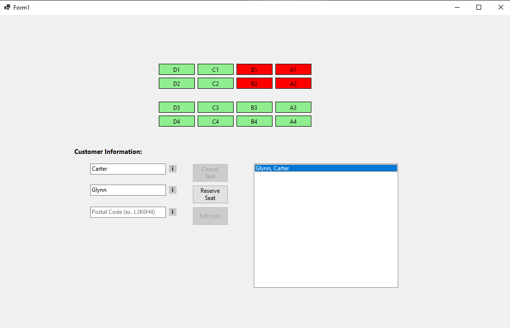

# *unfinished* Flight-Reservation-System  

## Goal
 - Demonstrate GUI knowledge
 - Utilize usability principles
 - Sharpen C# skills

## Description
Using C#, create a GUI based program to be used by a sales person at a travel agency.  
The program allows the sales person to: 

1. See the layout of seats
 - You can design your own layout on the GUI as long as you have a minimum of 12 seats;
 - Each seat has its unique number displayed on the GUI ;
 - A reserved seat is shown in red color;
 - An available seat is shown in green;
2. Reserve seats on a flight
 - Clicking on an available seat results in enabling a “reserve seat” button and text boxes that can be used to collect the following details for the reservation:
  - Passenger’s first and last names (Please validate each name to not be empty);
  - Passenger’s postal code (Perform validation on postal code);
  - Clicking the “reserve seat” button reserves the seat and adds the passenger’s name to the list of passengers shown in a list box;
 - Clicking on a reserved seat results in:
  - Displaying the passenger details, discussed above, in the text boxes;
  - Enabling a “cancel seat” button. Clicking this button results in canceling the reservation, removing the passenger from the passenger list (list box), and making the seat available again;
  - Enabling an “update” button to allow updating the passenger details. Please perform the name and postal code validations mentioned earlier prior to allowing an update;
3. See the list of passengers;
 - Clicking on a reserved seat selects (highlights) the passenger name in the list and displays the passenger
details (name etc.), in the text boxes;
 - The list needs to be sorted by last name;
 - Selecting a passenger name directly in the list has the same behavior as that mentioned in 2. ii (that is, clicking on a reserved seat);
4. Cancel an existing reservation 
 - Canceling results in the passenger name removed from the passenger list and the canceled seat becoming available again.
